# Arquitectura y API

## Flujo

```mermaid
flowchart LR
    Browser[Frontend Thymeleaf + JS] -->|POST /api/quotes| Controller[QuoteController]
    Controller --> Service[QuoteService]
    Service -->|Director + Builder| Outer[Decorador exterior]
    Outer --> Inner[Decoradores interiores]
    Inner --> Base[StandardShipment]
    Base -->|Quote base| Inner
    Inner -->|Quote enriquecida| Outer
    Outer -->|Quote final| Service
    Service -->|QuoteResponse| Controller
    Controller -->|JSON| Browser
```



`PageController` sirve `index.html` y el catálogo. `QuoteController` expone los cálculos. `QuoteService` valida la entrada y pide la cadena de wrappers a `ShipmentDirector`, que dirige a `ShipmentBuilder` paso a paso (patrón Builder). El dominio no depende de Spring y cada servicio concreto se ocupa de su propia regla. `ApiExceptionHandler` convierte entradas inválidas en HTTP 400 con un mensaje utilizable.

## Contratos del dominio

`Shipment.quote()` devuelve una `Quote` inmutable: total COP, plazo en horas, desglose ordenado, capacidades y expresión Java de composición. `Quote.wrap()` copia las listas, añade una línea y una capacidad, actualiza el total/plazo y describe el nuevo wrapper.

`ShipmentContext` valida ciudades, rutas, peso y valor. Las ciudades disponibles son Bogotá, Medellín, Cali y Barranquilla. Se rechaza una ruta con origen igual a destino. Peso permitido: 0,1–25 kg; valor: $10.000–$20.000.000, con hasta dos decimales.

Los decoradores comparten `ShipmentDecorator.wrapped`. La clase abstracta implementa `quote()` delegando en el componente envuelto; cada decorador concreto llama primero a `super.quote()` y luego agrega su responsabilidad. El nombre de clase que aparece en el desglose sale de `getClass().getSimpleName()`. El cliente depende de `Shipment`, no de una combinación concreta de clases.

## API

### GET `/api/services`

Devuelve una lista de objetos con `id`, `name`, `className`, `description`, `rate` y `code`. IDs válidos: `cold`, `monitor`, `custody`, `insurance`, `priority`.

### POST `/api/quotes`

```json
{
  "origin": "Bogotá",
  "destination": "Medellín",
  "weightKg": 2,
  "declaredValue": 1500000,
  "services": ["insurance", "priority"]
}
```

La respuesta contiene `shipment`, `base`, `decorated` y `disclaimer`. Cada cotización incluye `total`, `deliveryHours`, `lines`, `capabilities` y `expression`. El ejemplo retorna un total decorado de **65280** y **36 horas**, frente a una base de **36400**.

La lista de servicios se procesa de izquierda a derecha: cada nuevo decorador contiene al anterior. La lista vacía produce un transporte sin extras. Se rechazan servicios desconocidos y duplicados. Una lista omitida/nula se trata como vacía.

Errores de validación y JSON ilegible retornan HTTP 400:

```json
{"message":"El origen y el destino deben ser diferentes."}
```

### GET `/api/quotes/export`

Recibe `origin`, `destination`, `weightKg`, `declaredValue` y parámetros `services` repetidos en el orden de composición. Usa el mismo servicio de Java que la cotización y entrega JSON con `Content-Disposition: attachment; filename="celsius-cotizacion.json"`.

La descarga del frontend envía los datos de la última cotización válida a este endpoint. Una modificación del formulario desactiva la descarga hasta recalcular.

No existen escrituras, cuentas ni persistencia de cotizaciones en esta API.

## Frontend

El formulario obtiene la metadata del catálogo a través de Thymeleaf. JavaScript conserva únicamente la selección, el orden y la última respuesta. Los números se formatean para `es-CO`. Los textos de la API se insertan con `textContent`, no como HTML.

Una modificación invalida el resultado descargable y muestra un estado pendiente. Al enviar, se bloquean controles hasta completar la solicitud. La petición tiene un límite de 10 segundos y muestra recuperación ante errores. La impresión dispone de una hoja de estilos que oculta el formulario y conserva composición y cotización.

La cadena visible sin calcular es una previsualización de selección; después del cálculo se usa la expresión devuelta por Java. Los botones de orden conservan el foco sobre la capa movida.

## Decimales y reproducibilidad

El dominio usa `BigDecimal` con constantes construidas desde cadenas y redondeo `HALF_UP` a COP enteros por capa. La entrada recibe hasta dos decimales. Los porcentajes actúan sobre valores ya calculados: por ello mover Prioridad tiene un efecto reproducible.

El catálogo de ejemplo y la lógica están versionados en los fuentes. Introducir tarifas reales requerirá una fuente aprobada de precios y reglas de compatibilidad, manteniendo la frontera entre ensamblado y cálculo.
