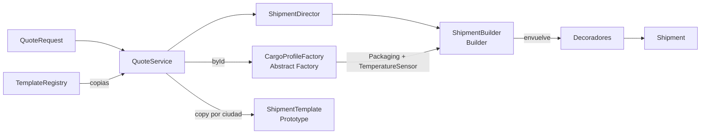

# Patrones creacionales: dónde están implementados

El proyecto parte del patrón estructural **Decorator** (`domain/decorator`). Sobre él se añadieron tres patrones creacionales. Cada uno resuelve un problema distinto de *creación* de los objetos que participan en la cotización.

| Patrón | Paquete | Problema que resuelve | Pruebas |
|---|---|---|---|
| Builder | `com.celsius.domain.builder` | Armar paso a paso la cadena de decoradores sin un `switch` disperso. | `ShipmentBuilderTest` |
| Abstract Factory | `com.celsius.domain.profile` | Crear empaque y sensor de la **misma familia térmica**. | `CargoProfileFactoryTest` |
| Prototype | `com.celsius.domain.prototype` | Crear envíos nuevos copiando uno ya configurado. | `ShipmentTemplateTest` |

Todas las rutas siguientes son relativas a `src/main/java/com/celsius/`.



## Builder

**Archivos**

| Rol GoF | Clase | Archivo |
|---|---|---|
| Builder / ConcreteBuilder | `ShipmentBuilder` | `domain/builder/ShipmentBuilder.java` |
| Director | `ShipmentDirector` | `domain/builder/ShipmentDirector.java` |
| Product | `Shipment` (cadena de decoradores) | `domain/Shipment.java` |
| Cliente | `QuoteService.calculate()` | `application/QuoteService.java` |

**Cómo funciona**

- El constructor de `ShipmentBuilder` parte de `new StandardShipment(context)`.
- Cada paso (`coldChain()`, `temperatureMonitor()`, `custody()`, `insurance()`, `priority()`) envuelve el resultado anterior con su decorador. El orden de llamada es el orden de composición.
- Un paso repetido lanza `IllegalArgumentException` ("Cada servicio se puede añadir una sola vez").
- `service(id)` traduce un id del catálogo al paso correspondiente.
- `build()` devuelve el `Shipment` terminado.
- `ShipmentDirector.construct(builder, ids)` recorre la selección del usuario; `ShipmentDirector.vaccines(builder)` es una receta fija (frío + registro + custodia).

```java
Shipment shipment = new ShipmentBuilder(context, profile).insurance().priority().build();
// equivale a new PriorityDecorator(new InsuranceDecorator(new StandardShipment(context), ...))
```

## Abstract Factory

**Archivos** (todos en `domain/profile/`)

| Rol GoF | Clases |
|---|---|
| AbstractFactory | `CargoProfileFactory` |
| ConcreteFactory | `RefrigeratedProfileFactory`, `FrozenProfileFactory`, `ControlledRoomProfileFactory` |
| AbstractProduct A | `Packaging` |
| ConcreteProduct A | `RefrigeratedPackaging`, `FrozenPackaging`, `ControlledRoomPackaging` |
| AbstractProduct B | `TemperatureSensor` |
| ConcreteProduct B | `DataLoggerSensor`, `CryogenicSensor`, `ExposureIndicatorSensor` |
| Selección de fábrica | `CargoProfiles.byId()` |
| Cliente | `ShipmentBuilder`, que entrega los productos a `ColdChainDecorator` y `TemperatureMonitorDecorator` |

**Familias**

| Fábrica (`profile`) | Empaque | Sensor |
|---|---|---|
| `RefrigeratedProfileFactory` (`refrigerated`, 2–8 °C) | `RefrigeratedPackaging`: $24.000 + $1.800/kg | `DataLoggerSensor`: $12.000 |
| `FrozenProfileFactory` (`frozen`, −25 a −15 °C) | `FrozenPackaging`: $38.000 + $3.500/kg | `CryogenicSensor`: $20.000 |
| `ControlledRoomProfileFactory` (`ambient`, 15–25 °C) | `ControlledRoomPackaging`: $9.000 + $600/kg | `ExposureIndicatorSensor`: $7.000 |

**Por qué Abstract Factory.** El empaque y el sensor deben ser coherentes: no tiene sentido hielo seco con un indicador de ambiente. El cliente elige **una** fábrica y obtiene ambos productos de ella, así la combinación incompatible no se puede construir. Los decoradores dependen solo de `Packaging` y `TemperatureSensor`. Para añadir un perfil nuevo basta con una fábrica y sus dos productos, sin tocar los decoradores.

Sin perfil, `CargoProfiles.byId(null)` devuelve la fábrica refrigerada, con las tarifas originales del simulador. Un perfil desconocido produce HTTP 400.

## Prototype

**Archivos**

| Rol GoF | Clase | Archivo |
|---|---|---|
| Prototype | `Prototype<T>` (`T copy()`) | `domain/prototype/Prototype.java` |
| ConcretePrototype | `ShipmentTemplate` | `domain/prototype/ShipmentTemplate.java` |
| Registro de prototipos | `TemplateRegistry` | `domain/prototype/TemplateRegistry.java` |
| Clientes | `QuoteService.templates()` y `QuoteService.compareDestinations()` | `application/QuoteService.java` |

**Cómo funciona**

- `ShipmentTemplate` guarda una configuración completa (ruta, peso, valor, perfil y servicios). Es mutable a propósito.
- `copy()` hace una **copia profunda**: la lista de servicios se duplica, así modificar un clon nunca altera el original.
- `TemplateRegistry` guarda los escenarios de ejemplo (`vaccines`, `lab`, `base`) y **siempre entrega copias** (`get()`, `all()`). Los escenarios del selector de la interfaz salen de este registro (`GET /api/templates`); antes estaban fijos en el JavaScript.
- `compareDestinations()` crea un prototipo con el envío actual y, por cada ciudad distinta del origen, hace `prototype.copy().destination(ciudad)` y lo cotiza. Esta es la nueva función; ver [NUEVA_FUNCION.md](NUEVA_FUNCION.md).

```java
ShipmentTemplate clone = prototype.copy().destination("Cali");   // el prototipo sigue intacto
```
